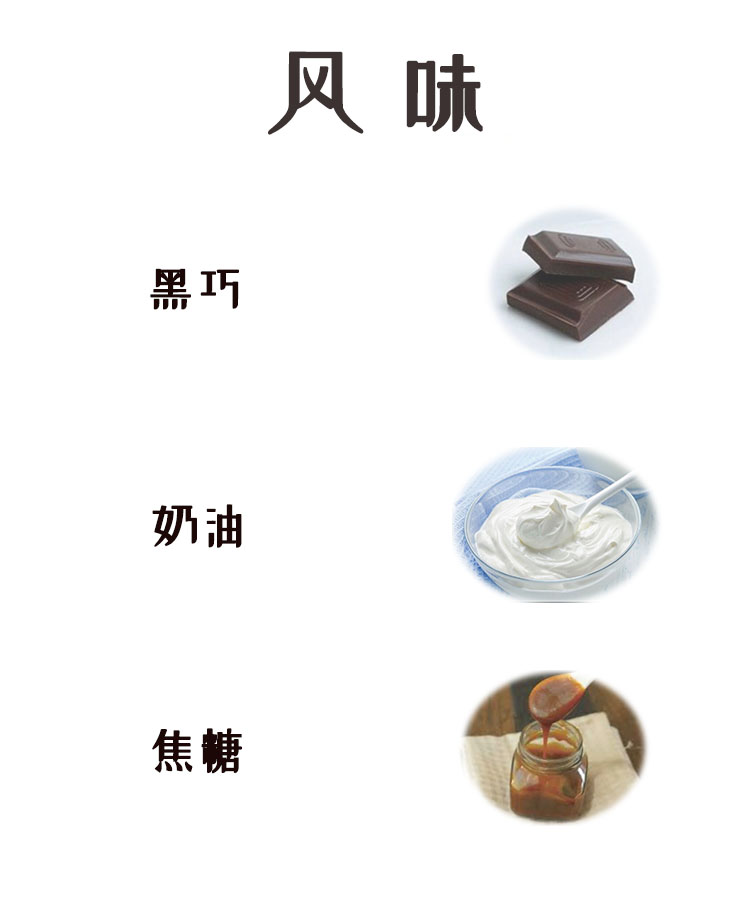

客户评价: 酒韵明显，粘稠厚重尾韵足。

---
##### 介绍
---

|产地 | 品种 | 烘焙度 | 口感 | 备注|特殊情况|
|:---:|:---:|:---:|:---:|:---:|:---:|
|危地马拉 | 危地马拉 | 轻度烘培 | 酒韵，蓝莓 | 酒香余韵，甜中带果香|豆子有时候会缺货属于正常，已经失去风味的豆子不卖|

*[HTML]: Hyper Text Markup Language
*[CSS]: Cascading Style Sheets
